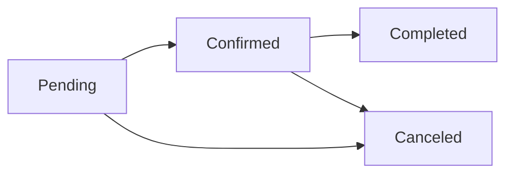

# Helpo - Service Booking Platform

A modern service booking platform built with Next.js, TypeScript, and Prisma. Helpo connects users with trusted professionals for home care, repairs, pet services, and learning.

## 🚀 Features

### 📅 Booking Management System
- **Status-based UI** - Dynamic button display based on booking status
- **Smart Status Flow** - Pending → Confirmed → Completed/Canceled
- **Comprehensive Cancellation** - Modal with predefined reasons and custom details
- **Real-time Updates** - Instant booking status changes
- **DateTime Handling** - Proper timezone and format conversion

### 🎨 User Interface
- **Status Color Coding**:
  - 🟡 Pending - Yellow
  - 🟢 Confirmed - Green  
  - 🔵 Completed - Blue
  - 🔴 Canceled - Red
- **Responsive Design** - Mobile-first approach with desktop optimization
- **Modern Components** - Built with shadcn/ui component library
- **Interactive Elements** - Smooth animations and transitions

### 🔍 Service Discovery
- **Smart Search** - Category filtering with intuitive icons
- **Service Categories**:
  - 🏠 Home Care (Cleaning)
  - 🔧 Fix It (Repair)
  - 🐕 Pet Care
  - 📚 Learn (Lessons)
- **Advanced Filtering** - Location, date, time, and price filters
- **Service Cards** - Rich information display with ratings and pricing

### 🛠 Technical Architecture
- **Type-Safe API** - Comprehensive TypeScript interfaces
- **Database Integration** - Prisma ORM with PostgreSQL
- **Performance Optimized** - useMemo for API clients, efficient re-renders
- **Error Handling** - Robust error boundaries and user feedback

## 🏗 Technology Stack

### Frontend
- **Next.js 15.5.0** - React framework with App Router
- **TypeScript** - Full type safety
- **Tailwind CSS** - Utility-first styling
- **shadcn/ui** - Modern component library
- **Radix UI** - Headless UI primitives

### Backend
- **Next.js API Routes** - Server-side endpoints
- **Prisma** - Database ORM and migrations
- **PostgreSQL** - Primary database
- **TypeScript** - Server-side type safety

### Development Tools
- **Turbopack** - Fast development builds
- **ESLint** - Code linting
- **Git** - Version control

## 📁 Project Structure

```
helpo-web/
├── src/
│   ├── app/
│   │   ├── api/dev/          # API endpoints
│   │   │   ├── bookings/     # Booking CRUD operations
│   │   │   ├── services/     # Service management
│   │   │   ├── providers/    # Provider profiles
│   │   │   └── ...
│   │   ├── bookings/         # Booking pages
│   │   │   ├── [id]/         # Booking details
│   │   │   └── new/          # Create booking
│   │   ├── services/         # Service discovery
│   │   └── ...
│   ├── components/
│   │   ├── ui/               # Reusable UI components
│   │   └── navbar.tsx        # Navigation component
│   ├── lib/
│   │   ├── api-client.ts     # Type-safe API client
│   │   ├── prisma.ts         # Database client
│   │   └── utils.ts          # Utility functions
│   └── hooks/                # Custom React hooks
├── prisma/
│   ├── schema.prisma         # Database schema
│   ├── migrations/           # Database migrations
│   └── seed.js              # Sample data
└── public/                   # Static assets
```

## 🎯 Key Components

### Booking Detail Page (`/bookings/[id]`)
- **Dynamic Status Display** - Shows relevant actions based on booking status
- **Cancellation Modal** - Comprehensive reason selection with custom details
- **Service Information** - Provider details, pricing, and duration
- **Action Buttons** - Modify, Contact, Cancel based on status

### Service Discovery (`/services`)
- **Category Pills** - Visual category selection with icons
- **Search Interface** - Advanced filtering and sorting
- **Service Cards** - Rich information display
- **Responsive Grid** - Adapts to screen size

### API Client (`/lib/api-client.ts`)
- **Type-Safe Methods** - Full TypeScript coverage
- **Error Handling** - Consistent error management
- **Server/Client Split** - Optimized for SSR and CSR

## 🔄 Booking Status Flow



### Status-Based Actions
- **Pending**: Modify, Contact, Cancel
- **Confirmed**: Modify, Contact, Cancel  
- **Completed**: Contact only
- **Canceled**: No actions available

## 🎨 Design System

### Color Palette
- **Primary**: Blue (#3B82F6)
- **Success**: Green (#10B981)
- **Warning**: Yellow (#F59E0B)
- **Danger**: Red (#EF4444)
- **Gray Scale**: Modern neutral tones

### Typography
- **Headings**: Font weights 600-700
- **Body**: Font weight 400-500
- **Captions**: Font weight 400, smaller sizes

## 🚀 Getting Started

### Prerequisites
- Node.js 18+ 
- PostgreSQL database
- npm or yarn

### Installation

1. **Clone the repository**
   ```bash
   git clone https://github.com/mikedph7/helpo.git
   cd helpo/helpo-web
   ```

2. **Install dependencies**
   ```bash
   npm install
   ```

3. **Set up environment variables**
   ```bash
   cp .env.example .env
   # Add your database URL and other config
   ```

4. **Set up the database**
   ```bash
   npx prisma generate
   npx prisma db push
   npx prisma db seed
   ```

5. **Start the development server**
   ```bash
   npm run dev
   ```

6. **Open in browser**
   ```
   http://localhost:3000
   ```

## 📊 Database Schema

### Core Entities
- **Users** - Customer profiles and authentication
- **Providers** - Service provider profiles with ratings
- **Services** - Service offerings with categories and pricing
- **Bookings** - Booking records with status tracking
- **Reviews** - Customer feedback and ratings
- **Favorites** - User saved services

### Key Relationships
- User → Bookings (One-to-Many)
- Provider → Services (One-to-Many)  
- Service → Bookings (One-to-Many)
- Booking → Reviews (One-to-One)

## 🔧 API Endpoints

### Bookings
- `GET /api/dev/bookings` - List bookings
- `GET /api/dev/bookings/[id]` - Get booking details
- `POST /api/dev/bookings` - Create booking
- `PUT /api/dev/bookings/[id]` - Update booking
- `DELETE /api/dev/bookings/[id]` - Cancel booking

### Services
- `GET /api/dev/services` - List services with filters
- `GET /api/dev/services/[id]` - Get service details

### Providers
- `GET /api/dev/providers` - List providers
- `GET /api/dev/providers/[id]` - Get provider profile
- `GET /api/dev/providers/[id]/availability` - Check availability

## 🎉 Recent Achievements

### v1.0 Release Features
- ✅ **Enhanced Booking Management** - Complete status-based workflow
- ✅ **Cancellation System** - Modal with predefined reasons
- ✅ **Status Color Coding** - Visual status indicators
- ✅ **API Error Fixes** - DateTime conversion and infinite loop resolution
- ✅ **UI Component Library** - Complete shadcn/ui integration
- ✅ **Type Safety** - Comprehensive TypeScript coverage
- ✅ **Database Optimization** - Prisma schema with proper relationships

### Bug Fixes
- 🔧 Fixed datetime conversion error in booking API updates
- 🔧 Resolved infinite loop issue in booking detail page
- 🔧 Added proper destructive button styling with CSS variables
- 🔧 Optimized API client instantiation with useMemo

## 🚀 Deployment

### Vercel (Recommended)
1. Connect your GitHub repository
2. Configure environment variables
3. Deploy automatically on push

### Docker
```bash
# Build the image
docker build -t helpo-web .

# Run the container
docker run -p 3000:3000 helpo-web
```

## 🤝 Contributing

1. Fork the repository
2. Create a feature branch (`git checkout -b feature/amazing-feature`)
3. Commit your changes (`git commit -m 'Add amazing feature'`)
4. Push to the branch (`git push origin feature/amazing-feature`)
5. Open a Pull Request

## 📄 License

This project is licensed under the MIT License - see the [LICENSE](LICENSE) file for details.

## 👨‍💻 Author

**Mike** - [@mikedph7](https://github.com/mikedph7)

## 🙏 Acknowledgments

- Next.js team for the amazing framework
- shadcn for the beautiful component library  
- Vercel for deployment platform
- Prisma team for the excellent ORM

---

*Built with ❤️ using Next.js, TypeScript, and modern web technologies*
