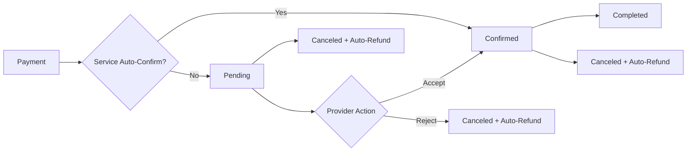

# Helpo - Service Booking Platform

A modern service booking platform built with Next.js, TypeScript, and Prisma. Helpo connects users with trusted professionals for home care, repairs, pet services, and learning.

## 🚀 Features

### 📅 Booking Management System
- **Smart Booking Flow** - Payment-first approach with auto-confirmation based on service settings
- **Auto-Confirm Services** - Providers can set services to auto-confirm or require manual approval
- **Status-based UI** - Dynamic button display based on booking status
- **Smart Status Flow** - Pending → Confirmed → Completed/Canceled with auto-refunds
- **Comprehensive Cancellation** - Modal with predefined reasons and automatic refunds
- **Real-time Updates** - Instant booking status changes with wallet integration
- **DateTime Handling** - Proper timezone and format conversion

### 💰 Payment & Wallet System
- **Dual Payment Options** - Wallet and manual payments (GCash/Bank Transfer)
- **Ledger-Based Wallet** - Double-entry bookkeeping system for financial accuracy
- **Auto-Refunds** - Automatic refunds to user wallet when provider cancels
- **Payment Disclaimers** - Clear messaging for services requiring provider approval
- **Proof Upload** - Image upload for manual payment verification

### 🎨 User Interface
- **Comprehensive Status System**:
  - 🟡 Awaiting Payment Verification - Admin reviewing payment proof
  - 🔵 Pending Provider Approval - Provider reviewing booking (auto_confirm=false only)
  - 🟢 Confirmed - Payment verified and booking approved
  - 🎉 Completed - Service delivered
  - ❌ Cancelled - Various cancellation reasons (customer/provider/admin)
- **Role-Based Actions**:
  - **Admin**: Payment verification only
  - **Provider**: Booking approval (when auto_confirm=false) + service delivery
  - **Customer**: Booking creation + payment proof submission
- **Responsive Design** - Mobile-first approach with desktop optimization
- **Modern Components** - Built with shadcn/ui component library
- **Interactive Elements** - Smooth animations and transitions
- **Payment Modals** - Integrated payment flow with service-specific messaging

### 🔍 Service Discovery
- **Smart Search** - Category filtering with intuitive icons
- **Service Categories**:
  - 🏠 Home Care (Cleaning)
  - 🔧 Fix It (Repair)
  - 🐕 Pet Care
  - 📚 Learn (Lessons)
- **Advanced Filtering** - Location, date, time, and price filters
- **Service Cards** - Rich information display with ratings and pricing

### 🛠 Technical Architecture
- **Type-Safe API** - Comprehensive TypeScript interfaces with auto_confirm support
- **Database Integration** - Prisma ORM with PostgreSQL and ledger system
- **Performance Optimized** - useMemo for API clients, efficient re-renders
- **Error Handling** - Robust error boundaries and user feedback
- **Financial System** - Double-entry bookkeeping with automatic reconciliation

## 🏗 Technology Stack

### Frontend
- **Next.js 15.5.0** - React framework with App Router
- **TypeScript** - Full type safety with service auto-confirm interfaces
- **Tailwind CSS** - Utility-first styling
- **shadcn/ui** - Modern component library with payment modals
- **Radix UI** - Headless UI primitives

### Backend
- **Next.js API Routes** - Server-side endpoints with wallet integration
- **Prisma** - Database ORM and migrations with ledger support
- **PostgreSQL** - Primary database with financial tables
- **WalletService** - Ledger-based payment and refund system
- **TypeScript** - Server-side type safety

### Development Tools
- **Turbopack** - Fast development builds
- **ESLint** - Code linting
- **Git** - Version control

## 📁 Project Structure

```
helpo-web/
├── src/
│   ├── app/
│   │   ├── api/dev/          # API endpoints
│   │   │   ├── bookings/     # Booking CRUD operations
│   │   │   ├── services/     # Service management
│   │   │   ├── providers/    # Provider profiles
│   │   │   └── ...
│   │   ├── bookings/         # Booking pages
│   │   │   ├── [id]/         # Booking details
│   │   │   └── new/          # Create booking
│   │   ├── services/         # Service discovery
│   │   └── ...
│   ├── components/
│   │   ├── ui/               # Reusable UI components
│   │   └── navbar.tsx        # Navigation component
│   ├── lib/
│   │   ├── api-client.ts     # Type-safe API client
│   │   ├── prisma.ts         # Database client
│   │   └── utils.ts          # Utility functions
│   └── hooks/                # Custom React hooks
├── prisma/
│   ├── schema.prisma         # Database schema
│   ├── migrations/           # Database migrations
│   └── seed.js              # Sample data
└── public/                   # Static assets
```

## 🎯 Key Components

### Booking Detail Page (`/bookings/[id]`)
- **Dynamic Status Display** - Shows relevant actions based on booking status
- **Cancellation Modal** - Comprehensive reason selection with custom details
- **Service Information** - Provider details, pricing, and duration
- **Action Buttons** - Modify, Contact, Cancel based on status

### Service Discovery (`/services`)
- **Category Pills** - Visual category selection with icons
- **Search Interface** - Advanced filtering and sorting
- **Service Cards** - Rich information display
- **Responsive Grid** - Adapts to screen size

### API Client (`/lib/api-client.ts`)
- **Type-Safe Methods** - Full TypeScript coverage
- **Error Handling** - Consistent error management
- **Server/Client Split** - Optimized for SSR and CSR

## 🔄 Booking Status Flow



### Status-Based Actions & Auto-Confirm Logic
- **Auto-Confirm Enabled**: Payment → Confirmed (instant booking)
- **Auto-Confirm Disabled**: Payment → Pending (requires provider approval)
- **Pending (Paid)**: Always paid in our payment-first model; Customer can modify/cancel, Provider can accept/reject
- **Confirmed (Paid)**: Service ready; Customer can contact/cancel, Provider can cancel (triggers refund)
- **Completed**: Service finished, Contact only
- **Canceled**: Automatic wallet refund if provider cancels

### Modifying Confirmed Bookings (Re-approval Rule)
- For services with `auto_confirm = false`, if a confirmed booking is modified (schedule, location, or notes), the booking status will revert to `pending` and requires provider approval again.
- This ensures providers can review material changes before reconfirming.

### Payment-First Flow
1. **Service Selection** - Customer selects service and time slot
2. **Payment Required** - All bookings require payment upfront; bookings are created only after successful payment/proof submission
3. **Status Determination** - Based on service `auto_confirm` setting:
   - `true`: Instant confirmation after payment
   - `false`: Pending approval (already paid) with disclaimer shown
4. **Provider Action** - For non-auto-confirm services, provider must approve
5. **Auto-Refund** - If provider cancels, customer gets automatic wallet refund

## 🎨 Design System

### Color Palette
- **Primary**: Blue (#3B82F6)
- **Success**: Green (#10B981)
- **Warning**: Yellow (#F59E0B)
- **Danger**: Red (#EF4444)
- **Gray Scale**: Modern neutral tones

### Typography
- **Headings**: Font weights 600-700
- **Body**: Font weight 400-500
- **Captions**: Font weight 400, smaller sizes

## 🚀 Getting Started

### Prerequisites
- Node.js 18+ 
- PostgreSQL database
- npm or yarn

### Installation

1. **Clone the repository**
   ```bash
   git clone https://github.com/mikedph7/helpo.git
   cd helpo/helpo-web
   ```

2. **Install dependencies**
   ```bash
   npm install
   ```

3. **Set up environment variables**
   ```bash
   cp .env.example .env
   # Add your database URL and other config
   ```

4. **Set up the database**
   ```bash
   npx prisma generate
   npx prisma db push
   npx prisma db seed
   ```

5. **Start the development server**
   ```bash
   npm run dev
   ```

6. **Open in browser**
   ```
   http://localhost:3000
   ```

## 📊 Database Schema

### Core Entities
- **Users** - Customer profiles and authentication
- **Providers** - Service provider profiles with ratings
- **Services** - Service offerings with categories and pricing
- **Bookings** - Booking records with status tracking
- **Reviews** - Customer feedback and ratings
- **Favorites** - User saved services

### Key Relationships
- User → Bookings (One-to-Many)
- Provider → Services (One-to-Many)  
- Service → Bookings (One-to-Many)
- Booking → Reviews (One-to-One)

## 🔧 API Endpoints

### Customer APIs
#### Bookings
- `GET /api/dev/bookings` - List customer bookings
- `GET /api/dev/bookings/[id]` - Get booking details
- `POST /api/dev/bookings` - Create booking
- `PUT /api/dev/bookings/[id]` - Update booking
- `DELETE /api/dev/bookings/[id]` - Cancel booking

#### Services
- `GET /api/dev/services` - List services with filters
- `GET /api/dev/services/[id]` - Get service details

#### Providers
- `GET /api/dev/providers` - List providers
- `GET /api/dev/providers/[id]` - Get provider profile
- `GET /api/dev/providers/[id]/availability` - Check availability

### Provider APIs
#### Dashboard & Bookings
- `GET /api/provider/dashboard` - Provider dashboard stats and quick actions
- `GET /api/provider/bookings` - List provider bookings with filtering
- `GET /api/provider/bookings/[id]` - Get detailed booking information
- `POST /api/provider/bookings/[id]/confirm` - Accept pending booking
- `POST /api/provider/bookings/[id]/decline` - Decline pending booking (auto-refund)
- `POST /api/provider/bookings/[id]/cancel` - Cancel confirmed booking (auto-refund)
- `POST /api/provider/bookings/[id]/complete` - Mark booking as completed

#### Services Management
- `GET /api/provider/services` - List provider services
- `POST /api/provider/services` - Create new service
- `PUT /api/provider/services/[id]` - Update service
- `DELETE /api/provider/services/[id]` - Delete service

#### Schedule & Availability
- `GET /api/provider/schedule` - Get provider schedule
- `PUT /api/provider/schedule` - Update availability
- `GET /api/provider/calendar` - Calendar view of bookings

#### Earnings & Wallet
- `GET /api/provider/earnings` - Earnings summary and history
- `POST /api/provider/withdrawals` - Request payout

## 🎉 Recent Achievements

### v4.0 Comprehensive Provider Booking Management
- ✅ **Enhanced Bookings Overview** - Tabbed interface with Pending, Confirmed, Completed, Canceled filters
- ✅ **Advanced Booking Cards** - Rich information display with customer details, service info, and status badges
- ✅ **Detailed Booking View** - Comprehensive booking details page with customer information and service specifics
- ✅ **Status-Based Actions** - Context-aware action buttons (Confirm, Decline, Cancel, Complete) based on booking status
- ✅ **Calendar Integration** - Monthly calendar view with booking visualization and color-coded status indicators
- ✅ **Automatic Refunds** - Integrated wallet refunds for provider cancellations and declined bookings
- ✅ **Real-time Updates** - Instant booking status updates with page refresh after actions
- ✅ **Search & Filter** - Advanced filtering by status and search functionality across bookings
- ✅ **Today's Schedule** - Quick access to current day's bookings in calendar view

### v3.0 Provider Portal
- ✅ **Provider Dashboard** - Comprehensive overview with booking stats and quick actions
- ✅ **Role-Based Access Control** - Separate provider portal with PROVIDER role gating
- ✅ **Provider Authentication** - Dedicated login/register flow for providers
- ✅ **Provider Bookings Management** - Accept/decline pending bookings with status filters
- ✅ **Earnings Overview** - Financial summaries and payout tracking
- ✅ **Service Management** - CRUD operations for provider services
- ✅ **Schedule Management** - Calendar view and availability blocking
- ✅ **Provider Navigation** - Dedicated navbar with all provider sections

### v2.0 Payment & Booking System
- ✅ **Auto-Confirm System** - Services can be set to auto-confirm or require provider approval
- ✅ **Payment-First Booking Flow** - All bookings require payment before creation
- ✅ **Ledger-Based Wallet System** - Double-entry bookkeeping with proper financial controls
- ✅ **Automatic Refunds** - Provider cancellations trigger instant wallet refunds
- ✅ **Payment Disclaimers** - Clear messaging for services requiring approval
- ✅ **Enhanced Status Management** - Smart status flow based on service settings
- ✅ **Dual Payment System** - Wallet and manual payments with proof upload
- ✅ **Financial Accuracy** - Proper ledger entries and balance reconciliation

### v1.0 Base Features
- ✅ **Enhanced Booking Management** - Complete status-based workflow
- ✅ **Cancellation System** - Modal with predefined reasons
- ✅ **Status Color Coding** - Visual status indicators
- ✅ **API Error Fixes** - DateTime conversion and infinite loop resolution
- ✅ **UI Component Library** - Complete shadcn/ui integration
- ✅ **Type Safety** - Comprehensive TypeScript coverage
- ✅ **Database Optimization** - Prisma schema with proper relationships

### Bug Fixes & Improvements
- 🔧 Fixed payment flow for new bookings with two-phase approach
- 🔧 Implemented proper wallet balance calculations using ledger system
- 🔧 Added automatic refund processing for provider cancellations
- 🔧 Enhanced payment component with service-specific messaging
- 🔧 Resolved booking status logic to respect auto_confirm settings
- 🔧 Added comprehensive error handling for payment failures

## 🚀 Deployment

### Vercel (Recommended)
1. Connect your GitHub repository
2. Configure environment variables
3. Deploy automatically on push

### Docker
```bash
# Build the image
docker build -t helpo-web .

# Run the container
docker run -p 3000:3000 helpo-web
```

## 🤝 Contributing

1. Fork the repository
2. Create a feature branch (`git checkout -b feature/amazing-feature`)
3. Commit your changes (`git commit -m 'Add amazing feature'`)
4. Push to the branch (`git push origin feature/amazing-feature`)
5. Open a Pull Request

## 📄 License

This project is licensed under the MIT License - see the [LICENSE](LICENSE) file for details.

## 👨‍💻 Author

**Mike** - [@mikedph7](https://github.com/mikedph7)

## 🙏 Acknowledgments

- Next.js team for the amazing framework
- shadcn for the beautiful component library  
- Vercel for deployment platform
- Prisma team for the excellent ORM

---

*Built with ❤️ using Next.js, TypeScript, and modern web technologies*
